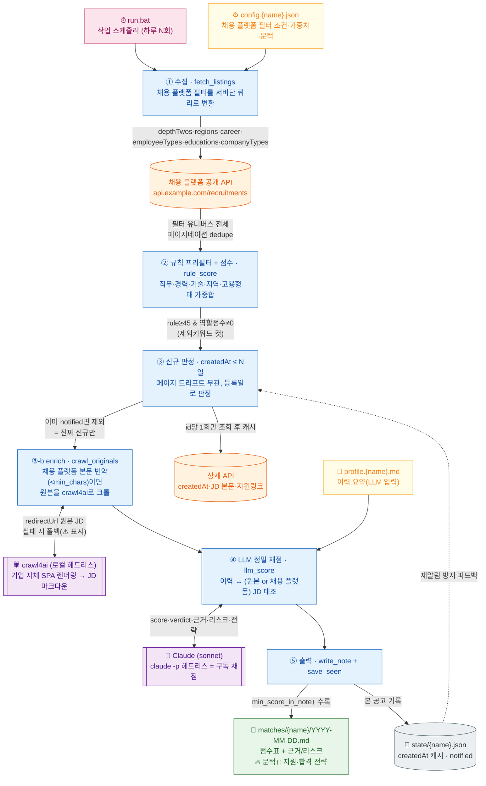

# 파이프라인 구조도

한 프로필 1회 실행의 흐름. `run.bat`이 프로필마다 이 흐름을 순서대로 돈다.



## 단계별 요약

| 단계 | 하는 일 | 핵심 포인트 |
|---|---|---|
| ① 수집 | 채용 플랫폼 필터 = API 파라미터로 변환해 유니버스 전체를 긁음 | 사이트에서 건 필터와 **동일 집합**. 소량이라 통째로 수집 |
| ② 규칙 점수 | 직무/경력/기술/지역/고용형태 가중합 | 값싼 프리필터. 문턱 미달·비대상 컷 |
| ③ 신규 판정 | 상세의 `createdAt`이 N일 이내만 | 페이지네이션 불안정 무관. 상세는 **id당 1회** 조회·캐시 |
| ③-b enrich | 채용 플랫폼 본문 빈약하면 원본을 crawl4ai로 크롤 | 기업 자체페이지 JD 확보. 실패 시 폴백 |
| ④ LLM 채점 | 이력 ↔ (원본/채용 플랫폼) JD 정밀 대조 | 구독(`claude -p`) 또는 API로 채점. 근거·리스크·**전략** 생성 |
| ⑤ 출력 | 노트 작성 + 상태 저장 | 문턱↑ 🔥+전략, notified로 재알림 방지 |

## 데이터 상태 (state/{name}.json)

```
{ "<공고id>": { "first_seen": "날짜", "created_at": "채용 플랫폼 등록시각",
                "notified": true, "rule": 80.0, "title": "..." } }
```

- `created_at`: 상세 재조회 안 하려는 캐시. `notified`: 재알림 방지.
- 필터·프로필을 크게 바꾸면 이 파일을 지우고 재실행 = 깨끗한 첫 다이제스트.

## 왜 이렇게(하이브리드 + createdAt) 설계했나

- **채용 플랫폼 API가 안정적 최신순 목록을 안 줌** → 단순 diff는 가짜 신규 폭증 → `createdAt`으로 판정.
- **규칙만으론 변별력 부족**(제목·카테고리만 봄) → 신규 소수만 LLM이 JD까지 읽어 정밀 채점.
- **비용 통제**: 값싼 규칙으로 좁히고, 진짜 신규(하루 몇 건)만 LLM. 상세도 신규만 조회.
